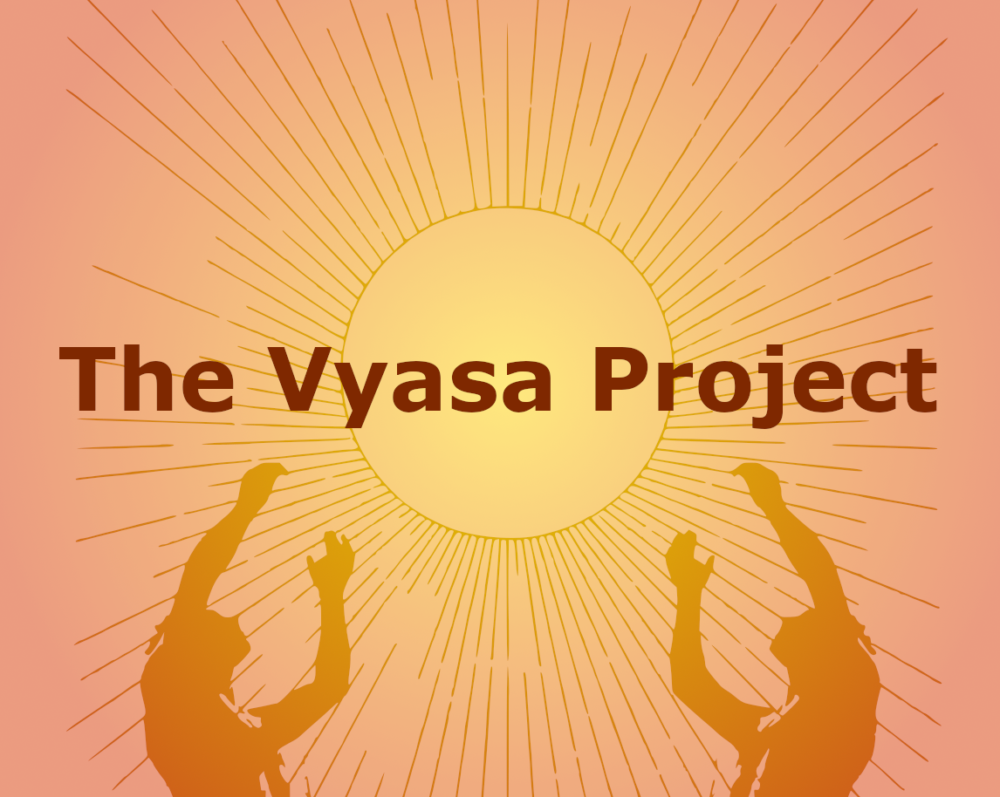

  <blockquote>
Wherever there be anything you dost not comprehend, cease to continue writing.  
-- Vyasa, Adi Parva - Mahabharatam
  </blockquote>
 
 

# Housekeeping

This project will always be a passion project, for the benefit of the greater community at large.

Here are some aspect of housekeeping to take note of:

## Licensing Information

We believe in the free software movement (free as in freedom) and hope that the spirit leads this project to achieve the longevity that it needs.

Therefore, we have put this software under the copyleft license, GNU General Public License v3 (GPLv3, here is the [license certificate](LICENSE)). This means that users can freely use, study, modify, and share software, with the condition that any distributed modifications must also be shared under the same license to ensure these freedoms are preserved.

