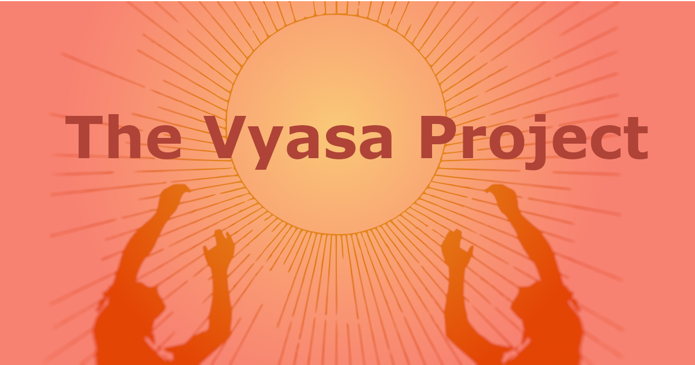

  <h1>Welcome</h1>

  
   
  

    
    
    
  

  <blockquote>
    Wherever there be anything you dost not comprehend, cease to continue
    writing.  
     — Vyasa, Adi Parva; Mahabharatam
  </blockquote>

## Overview

---

****This is a home for the fables and hymns that bring young and old together.****

---

> [!NOTE]
> This project is early in its development. Feature roll-outs follow the pace of what some of our partners and user-groups require.
> Please watch this repo on GitHub and follow [the blog](https://blog.vyasa.tv" "Vyasa Blog") for development updates.

Indic philosophy has always had a rich oral tradition, passed down across generations through word of mouth in the form of fables and hymns — inspiring people both in and out of the diaspora.

This project provides a digital medium for people to learn, share and engage in meaningful discourse around the topic of Indic philosophy. 

### Why start this?
<pre>
TODO give some bulletpoints for:
1. initial inspiration / behaviours
2. differentiating factors from other platforms (e.g. fragmented sources of text, some just stuck in PDFs and non-represented)
</pre>

#### Features 

<pre>
TODO closer to soft launch for initial test users
</pre>

# Getting Started 

<pre>
TODO closer to soft launch for initial test users
</pre>

# Housekeeping

This project seeks to serve the community at large and will always remain free-to-use. Here are some housekeeping-aspects to take note of:

## Licensing Information

We believe in the free software movement and that the values within it shall lead this project to achieve the longevity that it needs.

Therefore, we have put this software under the copyleft license, GNU General Public License v3 (GPLv3, here is the [license certificate](LICENSE)). This means that users can freely use, study, modify, and share software, with the condition that any distributed modifications must also be shared under the same license to ensure these freedoms are preserved.

